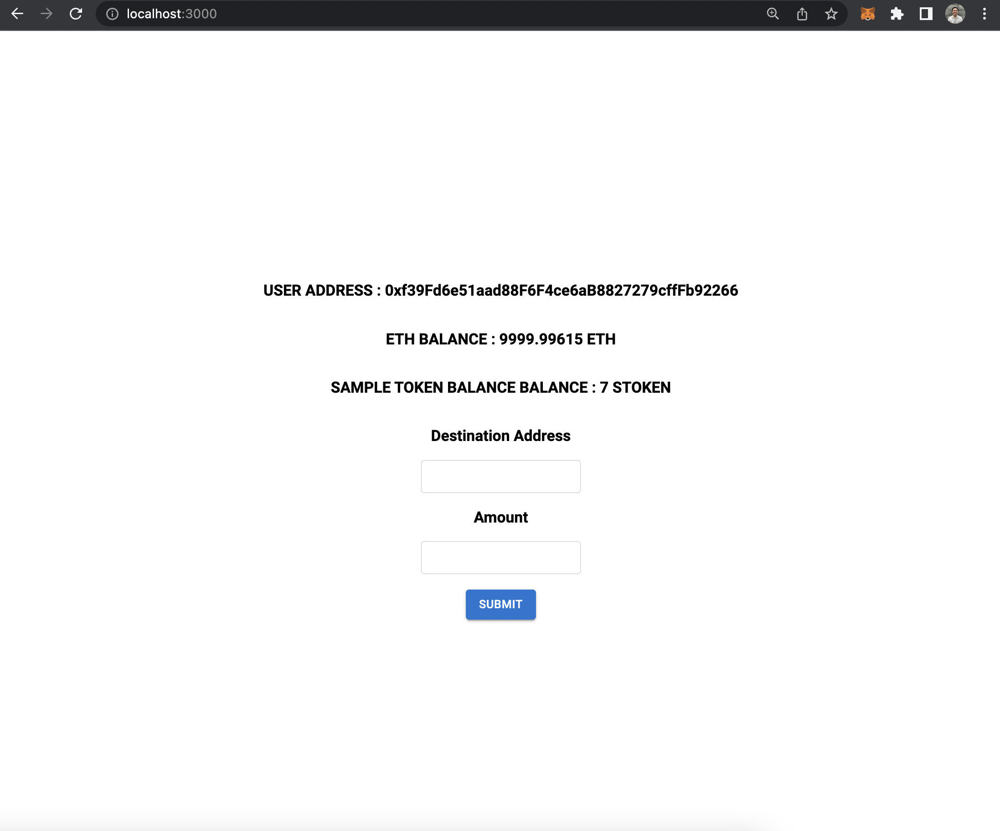
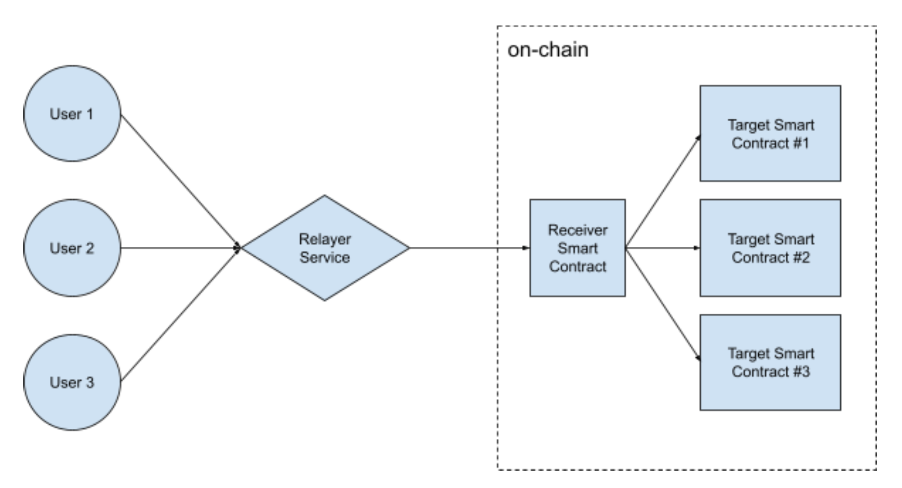
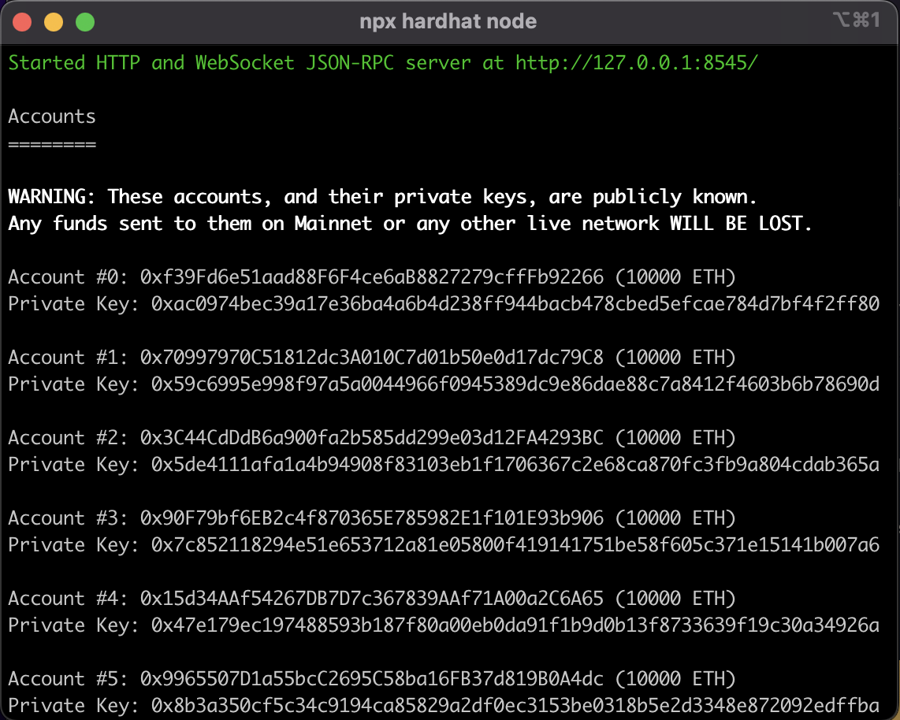
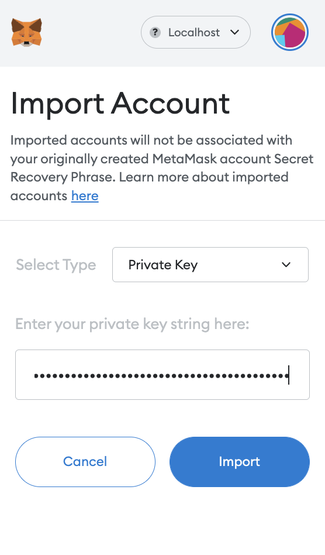
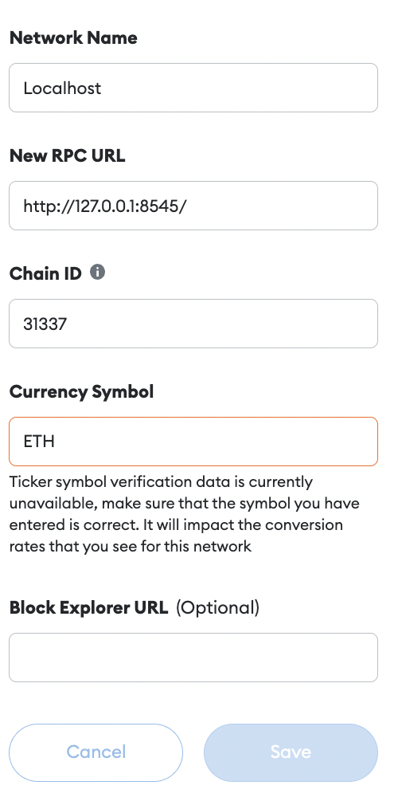
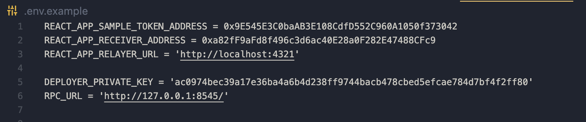

# Meta-Transaction-Project

##### App-preview


# Architecture



## Goals

#### User Transaction

| User Requirement  |  Status                       |
| :-------- | :-------------------------------- |
| Design a transaction structure based on EIP712 so that user can sign the transaction explicitly using EIP712-compatible wallet such as Metamask| ✅ |
| The target smart contract’s functions will be able to process the message| ✅ |


#### Meta-Transaction

| User Requirement  |  Status                       |
| :-------- | :-------------------------------- |
| Design a meta-transaction structure so that relayer will bundle user transactions based on it | ✅ |
| Receiver smart contract can parse the meta-transaction and handle the user transaction within it| ✅ |

#### Relayer Service

| User Requirement  |  Status                       |
| :-------- | :-------------------------------- |
| Multiple users can submit EIP712 structured messages to relayer service | ✅ |
| Relayer will check user submitted messages and reject ill-formed and invalid messages| ✅ |
| The batch will not exceed certain maximum gas limit| ✅ |
| The batch will be sent every X seconds even there’s only 1 transaction | ✅ |
| The economic model is out-of-scope. Just assume relayer is offering the relaying service free of charge| ✅ |

#### Receiver Smart Contract

| User Requirement  |  Status                       |
| :-------- | :-------------------------------- |
| Able to handle each user transaction independently, meaning that the revert or failure in any user transaction will not cause the failure of the entire meta-transaction | ✅ |

#### Target Smart Contract

| User Requirement  |  Status                       |
| :-------- | :-------------------------------- |
| Design an interface for the target smart contract | ✅ |
| Create an example target smart contract that’s based on ERC20 | ✅ |


## Developement Tools

 - NodeJS
 - NPM
 - Hardhat
 - Metamask
 - Browser that support metamask

## Installation

#### 1. Clone this repo

- rename .env.example to .env

#### 2. Installing dependencies

```bash
  cd meta-transaction-blockchain
  npm i
  cd smart_contract
  npm i
```

## Running The Apps

#### 1. Running hardhat node

```bash
  cd smart_contract
  npx hardhat node
```
The node should run at http://localhost:8545/



#### 2. Importing hardhat account and add metamask network
Importing deployer address to metamask
- copy private key of account 0 (deployer) that provided by hardhat
- open metamask
- choose import wallet 
- paste the private key
-- do this step to import account 1 and 2 



Importing deployer private key to Relayer service .env variable
- copy private key of account 0 (deployer) that provided by hardhat
- open .env
- paste into the variable DEPLOYER_PRIVATE_KEY

Adding hardhat network to metamask
- now add hardhat network to metamask
- rpc url  : http://localhost:8545/
- chainId : 31337
- currency symbol : ETH
- Save




#### 3. Deploying Smart Contract To Hardhat Node

```bash
  cd smart_contract
  npx hardhat run --network localhost scripts/deploy.ts
```

Importing SampleToken address to .env
- copy the address of SampleToken smart contract 
- open .env
- paste into the variable REACT_APP_SAMPLE_TOKEN_ADDRESS

Importing Receiver address to .env
- copy the address of Receiver smart contract
- open .env
- paste into the variable REACT_APP_RECEIVER_ADDRESS

Final .env file should look like this :




#### 4. Running the Relayer Service

```bash
  cd meta-transaction-blockchain
  npm run relayer
```
The service should run at http://localhost:4321/

#### 5. Running the React App

```bash
  cd meta-transaction-blockchain
  npm run start
```
The service should run at http://localhost:3000/


## Meta-Transaction Transfer Test

Transfer Test Using account 0
- visit http://localhost:3000/ on the browser
- connect your account 0 metamask (hardhat account) to the apps
- fill the address of destination (try to use address account 2)
- fIll the amount of SampleToken you want to transfer
- Hit submit
- There will be metamask popup to sign the message

Transfer Test Using account 1
- visit http://localhost:3000/ on the browser
- connect your account 1 metamsk (hardhat account) to the apps
- fill the address of destination (try to use address account 2)
- fIll the amount of SampleToken you want to transfer
- hit submit
- there will be metamask popup to sign the message

Relayer Service
- after user press submit the data will be send to the relayer service.
- relayer service will check the signature is valid or not.
- if the data valid, Relayer service will save the data and signature.
- relayer service will send the meta-transaction to the Receiver smart contract every 1 minute

Receiver Smart Contract
- receiver smart contract will processing the meta-transaction 
- receiver smart contract will not reverting all the transaction if there is only 1 or 2 or any error of user transaction

Expected Behavior
- all user transactions will successfully transfered
- the deployer will pay the gas fees
- account 1 will not be charged for gas fees
- account 2 will receive all the token that has been transfered from account 0 (deployer) and account 1


## Authors

- [@fgprayogo](https://www.github.com/fgprayogo)
---

